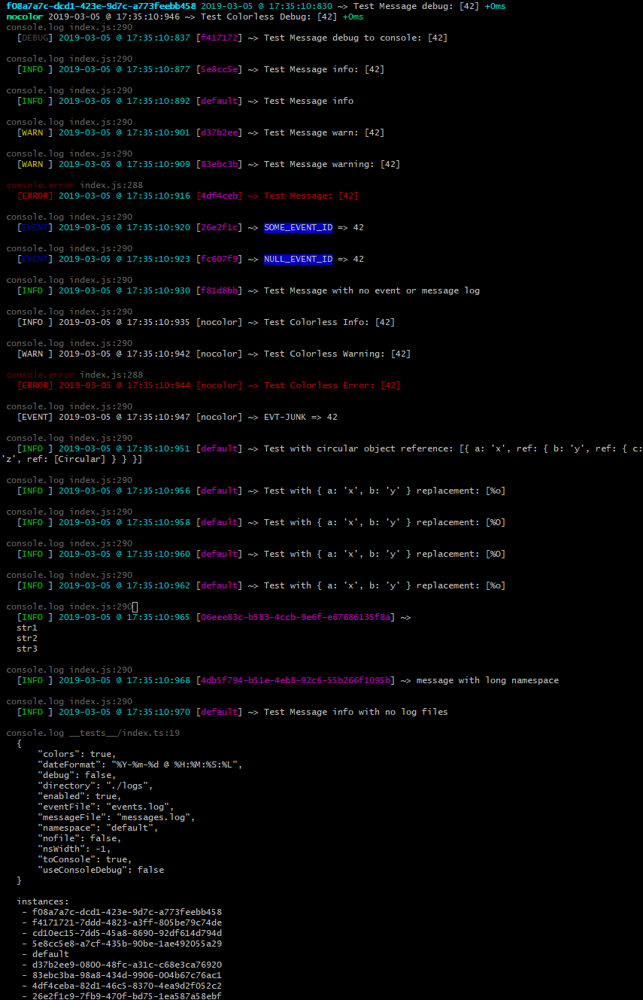

# util.log [](https://travis-ci.org/jmquigley/util.log) [](https://palantir.github.io/tslint/) [](https://github.com/avajs/ava) [](https://www.npmjs.com/package/util.log) [](https://coveralls.io/github/jmquigley/util.log?branch=master)

> A simple logging utility module


## Installation

This module uses [yarn](https://yarnpkg.com/en/) to manage dependencies and run scripts for development.

To install as an application dependency:
```
$ yarn add --dev util.log
```

To build the app and run all tests:
```
$ yarn run all
```

## Usage

```javascript
import logger from 'util.log';

const log = logger.instance();
log.info('This is a log message');
```

This uses the default options and logs an *info* level message to a file.  The message will be written to `./logs/messages.log`.  It will not write the message to `console.log` by default.

```javascript
import logger from 'util.log';

const log = logger.instance({
	directory: '/var/log/app',
	toConsole: true
});

log.info('This is a log message');

```
Similar to the first example.  This overrides the default configuration and changes the directory where the log files will be written.  This will write the log file `/var/log/app/messages.log`.  It also turns on console logging.

```javascript
import logger from 'util.log';

const log = logger.instance();
log.event('button onClick()', 'EVT_BUTTON_PRESSED');
```

Writes an event message to the `./logs/events.log` file.  The `EVT_BUTTON_PRESSED` is a string id associated with the event.  This is an optional parameter.  It's just a string that can be used to represent the event name.

```javascript
import logger from 'util.log');

const log = logger.instance();
log.info('This is a log message', __filename);
```

This will print the log message and the name of the file where the message originated.

All of the instances above are using the **default** (or root) logger.  The configuration options are associated with this namespace.  This behavior can be changed by using the `namespace` option when getting an instance.

```javascript
import logger from 'util.log';

const log = logger.instance({
	namespace: 'something',
	directory: '/var/log/app',
	toConsole: true
});

log.info('This is a log message');
```

This instance is associated with the *something* configuration namespace.  The default configuration still exists and an instance of it can be retrieved.  This allows multiple logging configurations to coexist.  **If no namespace is given, then the configuration is changing the default configuration**.

If an *undefined* namespace is given, then one is generated and assigned a UUID.

### Example Output



## Configuration
The `.instance()` method accepts the following parameters as an object to change the internal configuration:

- `colors` - Uses the chalk library to add color to the logging level in the messages.  This is on by default.  It adds ASCII escape sequences around the level to provide color (see [chalk](https://www.npmjs.com/package/chalk) module).
- `dateFormat` - the timestamp format used in [strftime](https://github.com/samsonjs/strftime).  The default is `%Y-%m-%d @ %H:%M:%S:%L`.
- `debug` - a boolean flag that turns the debug log messages on or off.  If true, then the logger will produce debug messages.  The default is `false`.
- `directory` - the directory location for the `messages` and `event` log files.  The default is the current directory with `logs` prepended to it.
- `enabled` - a boolean flag that turns the logger on or off.  If true, then the logger will produce messages, otherwise all messages are suppressed and no output is generated.  The default is `true`.
- `eventFile` - the output file name for all `event` messages.  Any message sent to `log.event()` will be placed in this log file.
- `messageFile` - the output file name for all `debug|info|warning|error` messages.  The default is `messages.log`.
- `namespace` - a unique name given to a logger instance.  By default is is `default` if no value is given when the instance is requested.
- `nsWidth` - the output message prints the namespace value.  It is truncated at a maxium length determined by this value.  The default is 15 characters.  If it is lesss than this size, then it is right padded with spaces.
- `toConsole` - a boolean flag that turns console logging on or off.  If true, then the message written to the log is also written to console.log/error, otherwise it the message is suppressed from the console.  The default is `false`.

## API
The module contains the following instance functions (after a successful call to `.instance()`):


- `.debug({string}[, filename])` - writes a debug message to the log.  This message is written in gray.
- `.error({string}[, filename])` - prints an error message to the log.  If the console logging is enabled, then it also writes to console.error.  These are written in red when color is enabled.
- `.event({string}[, {id}, filename])` - writes an event message (these are for react/redux events).  Used to track actions as they occur.  These are written to both the messages and the events log.  They are written in blue when color is enabled.
- `.info({string}[, filename])` - writes an info message to the log.  These are written in green when color is enabled.
- `.instance([{}])` - retrieves an instance of a logger.  This takes the configuration for this instance as an optional parameter.
- `.warn({string}[, filename])` or `warning()` - prints a warning message to the log.  These are written in yellow when color is enabled.
