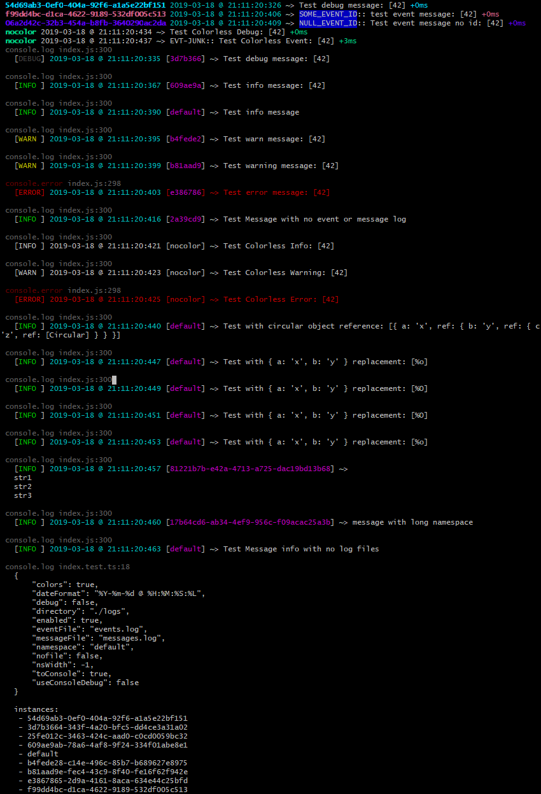

# util.log

> A simple logging utility module

[](https://github.com/jmquigley/util.log/actions)
[](https://palantir.github.io/tslint/)
[](https://github.com/prettier/prettier)
[](https://facebook.github.io/jest/)
[](https://www.npmjs.com/package/util.log)

A wrapper for output messages similar to log4j in java.  This module is intended for node/electron environments as it will write to files in the local environment.  It intercepts log messages and routes them to the console and to an output file.  A special case exists for debug messages where it wraps the [debug](https://www.npmjs.com/package/debug) module.


## Installation

This module uses [yarn](https://yarnpkg.com/en/) to manage dependencies and run scripts for development.

To install as an application dependency:
```
$ yarn add --dev util.log
```

To build the app and run all tests:
```
$ yarn run all
```


## Usage

```javascript
import logger from 'util.log';

const log = logger.instance();
log.info('This is a log message');
```

Uses the default options and logs an *info* level message to a file and to the console.  The messages passed to each logging function can contain variables.  They wrap the [sprintf.js](https://github.com/jmquigley/sprintf.js) module and allow dynamic formatting of the message.  See that module for formatting options.

```javascript
import logger from 'util.log';

const log = logger.instance();

const x: number = 42;
log.info('This is a log message: %d', x);
```

This code writes the log message to *info* and take in the dynamic *x* parameter as part of the outut string.  The next example shows how to override the default configuration:

```javascript
import logger from 'util.log';

const log = logger.instance({
	directory: '/var/log/app',
	toConsole: false
});

log.info('This is a log message');

```
Similar to the first example.  This overrides the default configuration and changes the output directory where the log files will be written.  This will write the log file `/var/log/app/messages.log`.  It also turns off console logging so the message is only written to the file.

```javascript
import logger from 'util.log';

const log = logger.instance();
log.event('EVT_BUTTON_PRESSED', 'button onClick()');
```

Writes an event message to the `./logs/events.log` file.  The `EVT_BUTTON_PRESSED` is a string id associated with the event.  It's just a string that can be used to represent the event name, but allows for routing/watching events segregated from the other messaging.  Note that all messages are written to the main log file, but that events have a special designation.

All of the instances above are using the **default** (or root) logger.  The configuration options are associated with this *namespace*.  This behavior can be changed by using the `namespace` option when retrieving an instance.

```javascript
import logger from 'util.log';

const log = logger.instance({
	namespace: 'something',
	directory: '/var/log/app'
});

log.info('This is a log message');
```

This logging instance is associated with the *something* configuration namespace.  The default configuration still exists and an instance of it can be retrieved and used.  This allows multiple logging configurations to coexist by namespace.  **If no namespace is given, then the value 'default' is used**.  If an *undefined* namespace is given, then a UUID is generated and assigned as the namespace.


### Example Output



## Configuration
The `.instance()` method accepts the following parameters as an object to change the internal configuration:

- `colors` - Uses the chalk library to add color to the logging level in the messages.  This is on by default.  It adds ASCII escape sequences around the level to provide color (see [chalk](https://www.npmjs.com/package/chalk) module).
- `dateFormat` - the timestamp format used in [strftime](https://github.com/samsonjs/strftime).  The default is `%Y-%m-%d @ %H:%M:%S:%L`.
- `debug` - a boolean flag that turns the debug log messages on or off.  If true, then the logger will produce debug messages.  The default is `false`.
- `directory` - the directory location for the `messages` and `event` log files.  The default is the current directory with `logs` prepended to it.
- `enabled` - a boolean flag that turns the logger on or off.  If true, then the logger will produce messages, otherwise all messages are suppressed and no output is generated.  The default is `true`.
- `eventFile` - the output file name for all `event` messages.  Any message sent to `log.event()` will be placed in this log file.
- `messageFile` - the output file name for all `debug|info|warning|error` messages.  The default is `messages.log`.
- `namespace` - a unique name given to a logger instance.  By default is is `default` if no value is given when the instance is requested.
- `nofile` - if this is true, then no file output will be generated.  Only console output.  The module creates the files by default (set to false)
- `nsWidth` - the output message prints the namespace value.  It is truncated at a maxium length determined by this value.  The default is 15 characters.  If it is lesss than this size, then it is right padded with spaces.  If the value is set to `-1` then the namespace value is set to the width of the namespace (the default).
- `toConsole` - a boolean flag that turns console logging on or off.  If true, then the message written to the log is also written to console.log/error, otherwise it the message is suppressed from the console.  The default is `true`.
- `useConsoleDebug` - a boolean flag that routes debug messages to console instead of the [debug](https://www.npmjs.com/package/debug) package.  This is false by default (using the debug module)

## API
The module contains the following instance functions (after a successful call to `.instance()`):


- `.debug({string}[, args])` - writes a debug message to the log.  This message is written in gray.
- `.error({string}[, args])` - prints an error message to the log.  If the console logging is enabled, then it also writes to console.error.  These are written in red when color is enabled.
- `.event(id, [{string}, args])` - writes an event message (these are typically for react/redux events).  Used to track actions as they occur.  These are written to both the messages and the events log.  They are written in blue when color is enabled.
- `.info({string}[, args])` - writes an info message to the log.  These are written in green when color is enabled.
- `.instance([{}])` - retrieves an instance of a logger.  This takes the configuration for this instance as an optional parameter.
- `.warn({string}[, args])` or `warning()` - prints a warning message to the log.  These are written in yellow when color is enabled.
